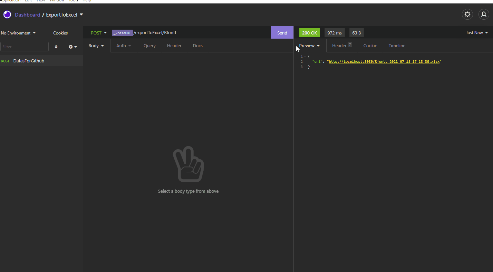

# Lidando com arquivos no node.js

A um mês atrás recebi uma tarefa a qual foi um desafio para mim e com ela adquiri muitos conhecimentos. Então resolvi compartilhar esses conhecimentos reformulando o desafio e deixando-o mais claro para quem estiver lendo aprender sobre como lidar com arquivos no node.js.

# Sobre o projeto:

Nesse projeto, vamos construir um exportador de dados json de repositórios do github para um arquivo em excel(xlsx), esses dados virão da api do github.
A nossa api contém uma rota que recebe um parâmetro com o nome do usuário do github que desejamos obter os dados do repositório.

Iremos utilizar a ferramenta que transforma json em um arquivo excel chamada excel4node. Irei dar uma breve explicação de como ela funciona, mas também deixarei aqui a documentação.

```
https://www.npmjs.com/package/excel4node
```

Mas qual problema iremos resolver aqui? Primeiramente, quando eu recebi o problema de exportar para excel vi que a tarefa era um pouco mais complexa do que apenas usar uma lib que oferece a solução. Então dividi esse problema em problemas menores, escolhi a lib certa que me permitiria dar ao usuário o que ele deseja: exportar os dados para uma planilha em excel. Sim, mas qual o problema? Já temos a lib que resolve, certo? Bom, em partes isso é verdade, o real problema não está no que vamos dar ao usuário e sim como nosso projeto vai ficar depois dessa nova funcionalidade, aonde esses arquivos vão ficar? Precisará de um bucket na AWS? Todos esses pontos precisam ser levados em consideração.

O maior problema que encontrei foi que todas as libs oferecem a solução de exportar, mas para isso é preciso primeiro salvar esses arquivos em algum lugar do meu projeto, elas não possuem alguma funcionalidade que se interliguem com uploads em nuvem e por isso eu teria que gerar esses arquivos localmente. Outro porém, é que para que eu irei querer guardar esses dados? Eles não interessam a mim e eu já o tenho armazenado em outro lugar, por isso não seria nada vantajoso deixá-lo na nuvem ocupando um espaço desnecessário. Então é nisso que vamos focar, em solucionar esse grande problema que me custou alguns dias, mas que me gerou bastante conhecimento. 

# Imagens do projeto:



# Excel4Node:

Como eu disse anteriormente, irei utilizar a lib excel4node para gerar as planilhas. Vamos codar?

> Primeiro vamos importá-la.

```javascript
import xlsx from 'excel4node';
```

> Depois vamos criar uma função que executa toda a ação de gerar a planilha e nela vamos colocar algumas configurações necessárias.

```javascript
// A função recebe os dados e o local onde iremos armazenar os arquivos gerados.
function GenerateExcel(Datas, filePath) {
// Cria uma janela da planilha.
const workbook = new xlsx.Workbook();
// Dar um nome a planilha e nos permite manipular as células.
const workSheet = workbook.addWorksheet("Datas github repository");
```

> Agora vamos criar uma constante que guarda um array com os nomes das colunas.

```javascript
const tableName = [
    'Name',
    'Description',
    'Language',
    'URL',
    'Branch'
];
```
> Em seguida, vamos declarar duas variáveis(let, por que let? Porque ela terá seu valor modificado dependendo da coluna/linha em que ela estiver), a primeira que declara um valor para o início da coluna e outra para o início da coluna.

```javascript
let headingColumnIndex = 1;
let rowIndex = 2;
```
> Agora vamos percorrer o array criado anteriormente com os nomes das colunas.

```javascript
 tableName.forEach((name) => {
    // Usamos a constante workSheet que nos permite manipular as células.
    // Aqui dizemos que a cada index do array um nome deve ser acrescentado na linha 1 e a coluna deve sempre contar + 1.
    workSheet.cell(1, headingColumnIndex++).string(name);
});
```

> Aqui temos uma parte bastante importante, é aqui que iremos percorrer o array de objetos que receberemos da requisição da api do github.

```javascript
Datas.forEach((data) => {
    // Aqui adicionamos o valor do full_name(O nome precisa ser exatamente como vem no objeto), como ela é strig e os demais também usamos o método string, porém existe vários outros;
    workSheet.cell(rowIndex, 1).string(data.full_name);
    // Aqui adicionamos o valor da description(O nome precisa ser exatamente como vem no objeto);
    workSheet.cell(rowIndex, 2).string(data.description);
    // Aqui adicionamos o valor da language(O nome precisa ser exatamente como vem no objeto);
    workSheet.cell(rowIndex, 3).string(data.language);
    // Aqui adicionamos o valor da url(O nome precisa ser exatamente como vem no objeto);
    workSheet.cell(rowIndex, 4).string(data.url);
    // Aqui adicionamos o valor da default_branch(O nome precisa ser exatamente como vem no objeto).
    workSheet.cell(rowIndex, 5).string(data.default_branch);

    rowIndex++;
})
```

> Por fim, salvamos esse arquivo com caminho que recebemos nos parâmetros da função:

```javascript
workbook.write(filePath);
// Fechamento da função.
}

// Não se esqueça de exportar para usamos essa função em outros lugares.
export { GenerateExcel }
```

# Controllers

Essa pasta irá ficar responsável de receber o nome do usuário do github, o qual deseja-se exportar seus dados de repositórios e também chamará a função que gera o arquivo excel.


importações necessárias:

```javascript
// Usaremos o axios para fazer a requisição a API do github.
import axios from 'axios';
// O path servirá para trabalharmos com caminho de arquivos.
import path from 'path';
// O moment irá nos ajudar a gerar um nome de arquivo que não se repetirá.
import moment from 'moment';
// Aqui chamaremos a função para gerar o excel.
import { GenerateExcel } from '../utils/gererateExcel.js';
```

> Agora vamos declarar a função que será asyncrona pelo fato de esperar dados que vão vim de uma requisição. Além disso, vamos declarar algumas constantes referentes ao arquivo que será gerado.

```javascript
async function ExportToExcelDatas(req, res) {
    // Receberemos do parâmetro da rota o nome do usuário.
    const { userName } = req.params;
    // Aqui será gerado a data e hora atual.
    const date = moment().format('YYYY-MM-DD-HH-mm-ss');
    // Aqui estamos buscando o caminho da pasta archives.
    const pathArchives = path.resolve('src', 'archives');
    // Aqui teremos o nome do arquivo
    const namePath = `${userName}-${date}.xlsx`;
    // Aqui temos o caminho completo juntamente com o nome do arquivo gerado.
    const filePath = `${pathArchives}/${userName}-${date}.xlsx`;
    // Aqui declaramos a url para que o usuário baixe o arquivo que está em uma rota estática.
    const url = `http://localhost:8080/${namePath}`;
```

> Agora vamos tratar alguns erros e gerar o arquivo em xlsx.


```javascript
try {
    // Faz a requisição a api do github e recebe os dados dos repositórios do usuário que foi declarado no parâmetro da requisição.
    const response = await axios({
        method: 'GET',
        url: `https://api.github.com/users/${userName}/repos`
    });

    // Verificamos se o usuário não existe
    if (response.data.length === 0) {
        return res.status(404).send({ error: "User not found" })
    // Se ele existir geramos o excel
    } else{
        // Passamos os dados que vem de response e está no objeto "data"; passamos também o filePath(caminho de onde ficará o nosso arquivo gerado);
        await GenerateExcel(response.data, filePath);

        // retornamos a url para que o usuário baixe.
        return res.json({ url: url });
    }
} catch(error) {
    return res.status(500).send({ error: error })
}
// Fechamento da função
}

export { ExportToExcelDatas };
```

E aqui concluímos e a nossa lógica de gerar o arquivo excel.

# Route

> Não podemos esquecer da rota, em? Confira como se faz na pasta **routes**. ;) 

``` javascript
import express from 'express';
import { ExportToExcelDatas } from '../controllers/exportToExcelDatas.js';

const route = express.Router();

route.post("/exportToExcel/:userName", ExportToExcelDatas);

export default route;
```

Agora sim, concluímos e o usuário já pode ficar feliz. :)
Mas espera, e o arquivos que vão ser gerados? Ficarão lá? Não, vamos resolver isso agora.

# O módulo fs:

O node nos permite trabalhar com a manipulação de arquivos usando o módulo **fs**, esse módulo é de extrema importância para quem deseja fazer coisas mais complexas com arquivos.

O que precisamos é listar todos os arquivos que estão na pasta archives todo final do dia e apagarmos eles para liberar espaço. Pra isso vamos conhecer os métodos readdir e unlink.

- readdir: É usado para listar todos os arquivos de um determinado diretório.
- unlink: Apaga arquivos de um determinado diretório.

> Vamos importar dois módulos importantes para iniciarmos:

``` javascript
import fs from 'fs';
import path from 'path';
```

> Agora vamos criar a função que lista todos os arquivos e depois deleta cada um. Vamos por partes.

``` javascript
function listAndRemoveFiles() {
  // Aqui a gente usa o path para sabermos em qual diretório está os arquivos.
  const directory = path.resolve('src', 'archives');
}
```

``` javascript
// Aqui vamos usar o readdir para listar os arquivos. Ele recebe alguns parâmetros necessários, são eles: o caminho de onde fica a pasta(diretório) e uma função de callback que recebe o erro caso ocorra e se não ocorreu os arquivos da pasta. 
fs.readdir(directory, (error, files) => {
    
});
```

``` javascript
 // Aqui vamos usar o readdir para listar os arquivos. Ele recebe alguns parâmetros necessários, são eles: o caminho de onde fica a pasta(diretório) e uma função de callback que recebe o erro caso ocorra e se não ocorreu os arquivos da pasta. 
fs.readdir(directory, (error, files) => {
    // Agora vamos fazer um for of em cada file para podermos deletá-los em seguida.
    for (const file of files) {
      
      });
    }
  });
```

``` javascript
// Aqui vamos usar o readdir para listar os arquivos. Ele recebe alguns parâmetros necessários, são eles: o caminho de onde fica a pasta(diretório) e uma função de callback que recebe o erro caso ocorra e se não ocorreu os arquivos da pasta. 
fs.readdir(directory, (error, files) => {
    // Agora vamos fazer um for of em cada file para podermos deletá-los em seguida.
    for (const file of files) {
      // Aqui a gente usa o método unlink para apagar cada arquivo, mas para isso precisamos juntar o caminho até a pasta com o nome do arquivo. Por isso usamos o path.join e passamos a constante directory que é o caminho em si e em seguida o nome do arquivo.
      fs.unlink(path.join(directory, file), error => {
       
      });
    }
});
```

> Por fim, vamos fazer algumas tratativas de erros.

``` javascript
// Aqui vamos usar o readdir para listar os arquivos. Ele recebe alguns parâmetros necessários, são eles: o caminho de onde fica a pasta(diretório) e uma função de callback que recebe o erro caso ocorra e se não ocorreu os arquivos da pasta. 
fs.readdir(directory, (error, files) => {
    // Agora vamos fazer um for of em cada file para podermos deletá-los em seguida.
    for (const file of files) {
      // Aqui a gente usa o método unlink para apagar cada arquivo, mas para isso precisamos juntar o caminho até a pasta com o nome do arquivo. Por isso usamos o path.join e passamos a constante directory que é o caminho em si e em seguida o nome do arquivo.
      fs.unlink(path.join(directory, file), error => {
        // Se tiver erro lançamos uma exception
        if(error) {
          throw error;
        } else {
        // Caso não tenha nenhum erro os arquivos serão apagados.
          return true;
        }
      });
    }
});


export { listAndRemoveFiles };
```

Pronto, finalizamos mais uma etapa, mas você não acha que acabou, né? Haha, na verdade ainda temos mais um passo, bem simples e mais conhecimento.

# Node-cron

O node cron ajuda em agendamentos, o qual é realizado de acordo com o algoritmo que vamos implementar. 
Lembra que eu falei anteriormente que a pasta **archives** deve ser limpada a cada final do dia, então iremos agendar com o node-cron para isso acontecer.

# StopWatch

> Vamos primeiro importar o que é necessário.

``` javascript
import cron from 'node-cron';
// O path nos auxiliou bastante, não é?
import path from 'path';
import { listAndRemoveFiles } from '../utils/fileHandling.js';
```

> Olha que simples o que vamos fazer aqui.

``` javascript
// Criar a função de agendamento
function StopWatch() {
    // Usar o método schedule para passarmos a ele o horário em que deve ser executado
    cron.schedule('59 23 * * *', () => {
      // Chamar a função que apaga os arquivos da pasta archives
      listAndRemoveFiles();
    });
}

// Lembre-se sempre de exportar
export { StopWatch };
```

E agora sim. Acabamos!

Lembre-se de importar o StopWatch no arquivo **app.js** que é onde o nosso servidor está rodando. Espero que tenha aprendido tanto quanto eu.